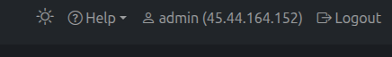
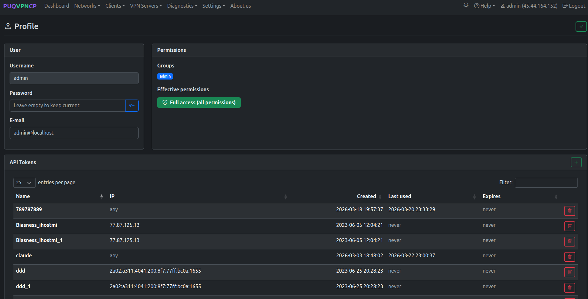
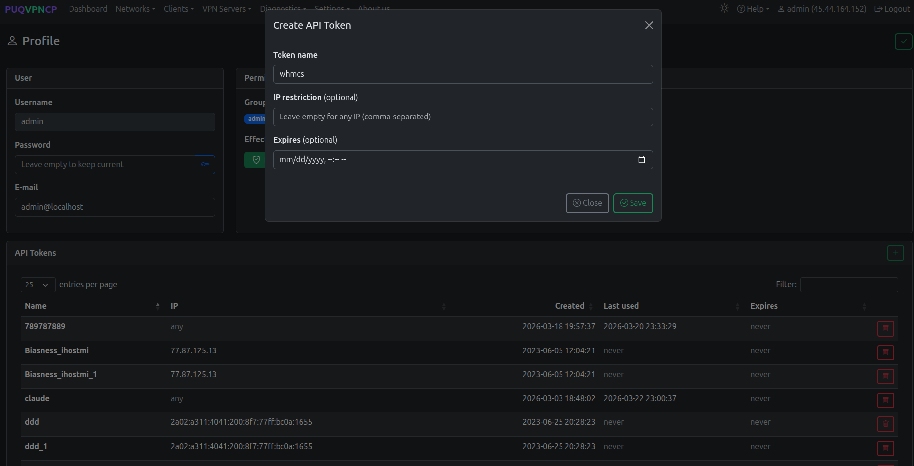
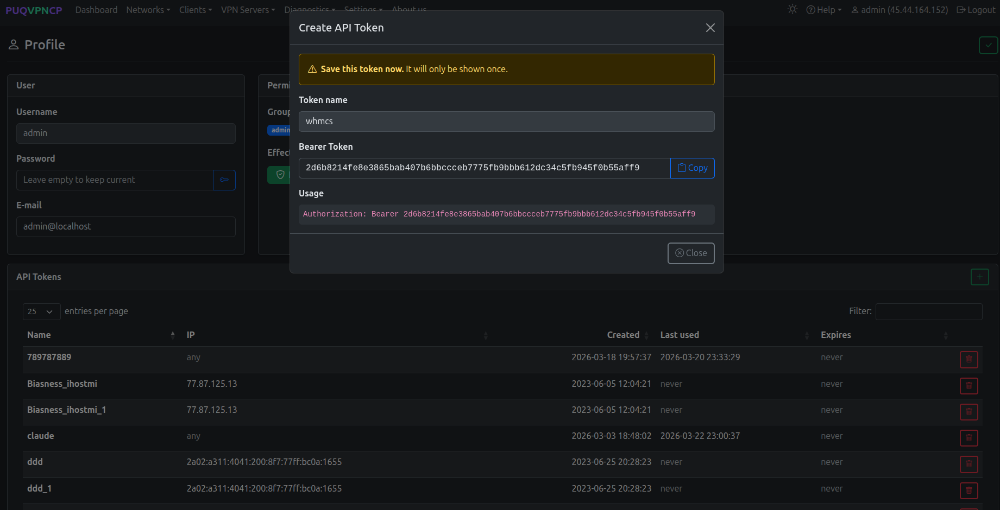
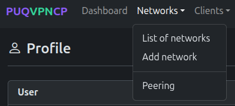
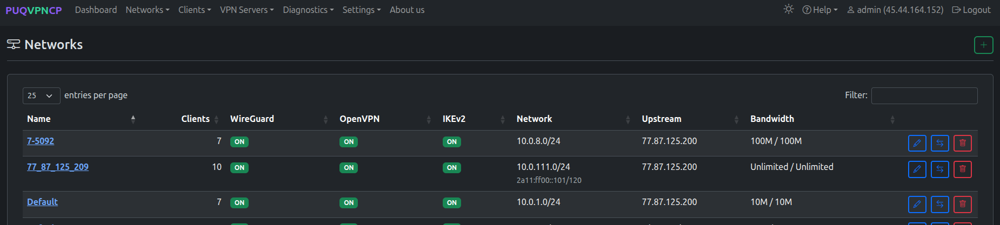
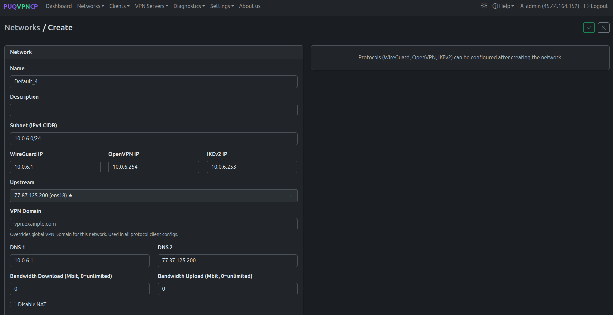
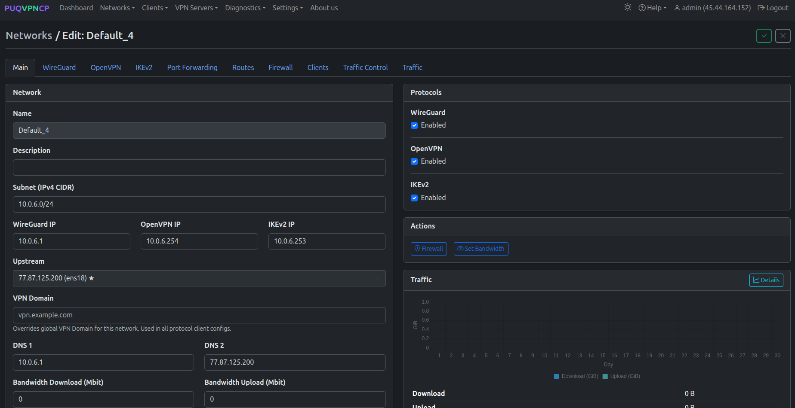

# Setup guide — PUQVPNCP panel

### PUQVPNCP module **[WHMCS](https://puqcloud.com/link.php?id=77)**
#####  [Order now](https://puqcloud.com/whmcs-module-puqvpncp.php) | [Download](https://download.puqcloud.com/WHMCS/servers/PUQ_WHMCS-PUQVPNCP/) | [COMMUNITY](https://community.puqcloud.com/) | [PUQVPNCP](https://puqvpncp.com/)

Before you can connect WHMCS, you need a running PUQVPNCP panel, an **API token** that WHMCS will use for every operation, and at least one **VPN network** with the protocols you want to expose enabled. This page walks through both.

---

## 1. Panel reachability

- The panel must be reachable from the WHMCS server over the network.
- HTTPS is strongly recommended. If you use a self-signed certificate, remember that SSL verification is enabled when the **Secure** checkbox is ticked on the WHMCS server record — use a publicly trusted certificate, or place the panel behind a reverse-proxy with one.

---

## 2. Issue an API token

The module authenticates to the panel with a **Bearer token** issued from the admin's profile page.

### Step 1 — Open Profile

Click your username in the top-right corner of the panel and select **Profile**.

*26-puqvpncp-profile-menu.png*

### Step 2 — Open the API Tokens section

Scroll down to the **API Tokens** card. Click the green **+** button on the right to create a new token.

*27-puqvpncp-profile-tokens.png*

### Step 3 — Create the token

Fill in the modal:

- **Token name** — a label that identifies the consumer, e.g. `whmcs`.
- **IP restriction** *(optional)* — a comma-separated list of IPs allowed to use this token. Leave empty to accept the token from any IP, or set it to your WHMCS server's IP for tighter security.
- **Expires** *(optional)* — an expiration date. Leave empty for a non-expiring token.

Click **Save**.

*28-puqvpncp-token-create.png*

### Step 4 — Copy the Bearer token

The next dialog shows the **Bearer Token**. Click **Copy** and store it somewhere safe — **the token is shown only once and cannot be retrieved later**. If you lose it, delete the token and generate a new one.

*29-puqvpncp-token-bearer.png*

> The token grants the user's **effective permissions** — the `admin` group used in the screenshot has full access. For tighter control, create a dedicated user/permission group on the panel and issue a token for that user instead.

You will paste this token into the **Password** field of the WHMCS server record — see [Add server](05-add-server.md).

---

## 3. Create a VPN network

The module needs at least one VPN network on the panel. On the WHMCS product configuration page, every available network is listed as a tickable `server → network` pair.

### Step 1 — Open the Networks list

In the top menu, open **Networks → List of networks**.

*30-puqvpncp-networks-menu.png*

The list shows every existing network with the status of WireGuard / OpenVPN / IKEv2, the IPv4 subnet, the upstream interface and the bandwidth caps.

*31-puqvpncp-networks-list.png*

### Step 2 — Add a network

Click the green **+** button in the top-right corner of the Networks page. Fill the **Create** form:

- **Name** — internal identifier of the network (used in the WHMCS product configuration).
- **Description** *(optional)* — human-readable note.
- **Subnet (IPv4 CIDR)** — VPN subnet that will be assigned to clients (e.g. `10.0.6.0/24`).
- **WireGuard IP / OpenVPN IP / IKEv2 IP** — gateway addresses for each protocol inside the subnet.
- **Upstream** — the host network interface used as the egress for this VPN network.
- **VPN Domain** *(optional)* — overrides the global VPN Domain in all client configs for this network.
- **DNS 1 / DNS 2** — DNS servers pushed to clients.
- **Bandwidth Download / Upload** — network-wide caps in Mbit/s (`0` = unlimited).
- **Disable NAT** — leave unchecked unless you route the VPN subnet upstream yourself.

Click the green **✓** in the top-right to save. Protocols (WireGuard / OpenVPN / IKEv2) are configured **after** the network is created.

*32-puqvpncp-network-create.png*

### Step 3 — Enable protocols on the network

After saving, you land on the network's **Edit** page with a row of tabs (Main / WireGuard / OpenVPN / IKEv2 / Port Forwarding / Routes / Firewall / Clients / Traffic Control / Traffic) and a **Protocols** card on the right.

Tick **Enabled** for every protocol you want to offer to customers via WHMCS. The WHMCS module reads this state from `GET /api/v1/network/{name}` — disabled protocols are hidden in the client area and shown greyed-out (with a tooltip) in the admin service tab.

*33-puqvpncp-network-edit-protocols.png*

Open each protocol-specific tab (**WireGuard**, **OpenVPN**, **IKEv2**) to fine-tune ports, ciphers, MTU and other parameters as needed. Defaults are sensible for most deployments.

---

## What's next

- Add the panel to WHMCS — see [Add server](05-add-server.md).
- Configure a WHMCS product backed by this panel — see [Product configuration](06-product-configuration.md).
