# Product configuration

### PUQVPNCP module **[WHMCS](https://puqcloud.com/link.php?id=77)**
#####  [Order now](https://puqcloud.com/whmcs-module-puqvpncp.php) | [Download](https://download.puqcloud.com/WHMCS/servers/PUQ_WHMCS-PUQVPNCP/) | [Community](https://community.puqcloud.com/) | [PUQVPNCP](https://puqvpncp.com/) | [Order PUQVPNCP](https://puqcloud.com/puqvpncp.php)

## Create the product

1. Navigate to **System Settings → Products/Services → Products/Services → Create a New Product**.
2. Product Type: **Other**. Give it a name (e.g. `VPN — 100 Mbit/s`).
3. On the **Module Settings** tab, pick **PUQ VPNcp** as the module and assign a server (or a server group).

After saving, the module injects a **PUQ VPNcp settings** panel below the standard module fields. All settings are persisted as JSON in `configoption24` of the product record.

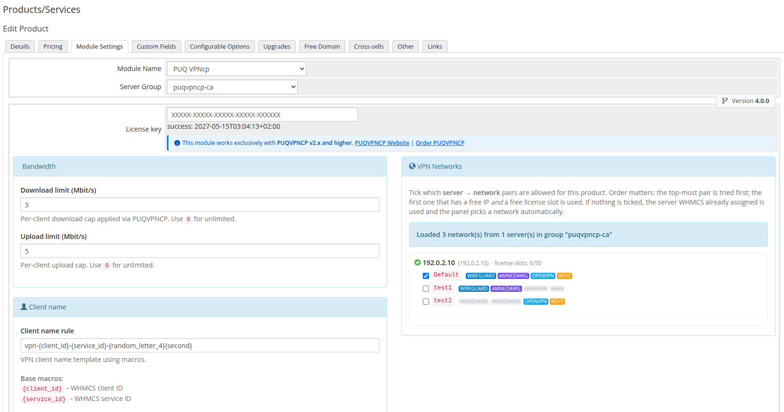
*06-product-configuration.png*

---

## License key

Paste your licence key into the **License key** field. The status row underneath shows the result of the most recent verification (`success: <timestamp>` or an error). The module re-checks the licence on every product page render and caches the result for the validity period encoded in the licence response.

---

## Bandwidth

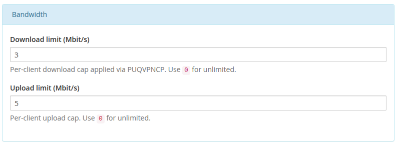
*07-product-config-bandwidth.png*

- **Download limit (Mbit/s)** — per-client download cap. `0` = unlimited.
- **Upload limit (Mbit/s)** — per-client upload cap. `0` = unlimited.

The module applies these via `PUT /api/v1/client/{name}` right after creating the client. The `POST /api/v1/client` create call does not accept bandwidth fields — the limits are always pushed through the follow-up update.

If the bandwidth update fails, the freshly created client is **rolled back** with `DELETE /api/v1/client/{name}` so billing never starts charging for an uncapped VPN.

---

## Client name

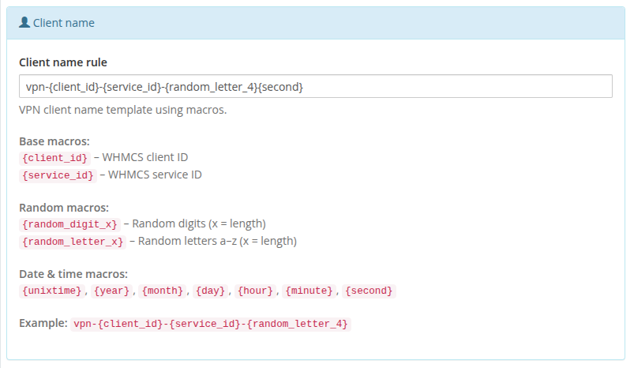
*08-product-config-client-name.png*

- **Client name rule** — template used to generate the VPN client identifier. Default: `vpn-{client_id}-{service_id}-{random_letter_4}`.

Available macros:

**Base macros**
- `{client_id}` — WHMCS client ID
- `{service_id}` — WHMCS service ID

**Random macros**
- `{random_digit_N}` — N random digits (e.g. `{random_digit_5}`)
- `{random_letter_N}` — N random lowercase letters

**Date & time macros**
- `{unixtime}`, `{year}`, `{month}`, `{day}`, `{hour}`, `{minute}`, `{second}`

If the generated name already exists in `tblhosting.username`, the module appends `-1`, `-2`, … until it finds a free one.

---

## Client Area

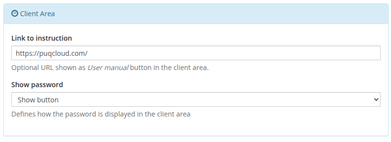
*09-product-config-client-area.png*

- **Link to instruction** — optional URL shown as a **User manual** button at the top of the client-area home screen. Leave empty to hide the button.
- **Show password** — controls how the VPN password is displayed in the client area: **Show button** (hidden by default, revealed on button click), **Plain text** (always visible), or **No** (hidden entirely).

---

## Welcome Email

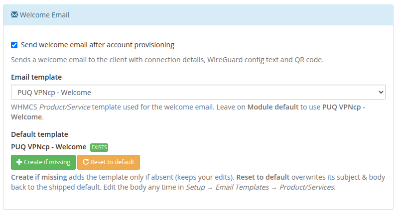
*34-product-config-welcome-email.png*

Send the customer everything they need to connect the moment their service goes live — automatically.

- **Send welcome email after account provisioning** — when ticked, the module emails the client right after the VPN account is created. The message includes the connection details, protocol configuration files and QR codes (WireGuard, AmneziaWG, OpenVPN, IKEv2), a One-Time Link, and a direct button to manage the service.
- **Email template** — which WHMCS *Product/Service* email template to send. Leave it on **Module default** to use the bundled **PUQ VPNcp - Welcome** template, or pick any of your custom templates.
- **Default template** — a one-click manager for the bundled template:
  - **Create if missing** — adds the **PUQ VPNcp - Welcome** template only if it does not exist yet (your edits are never overwritten). The badge shows **EXISTS** once it is in place.
  - **Reset to default** — restores the shipped subject and body with all protocol blocks and Smarty conditionals.

### Template Merge Variables

The email template supports Smarty tags and logic in **Setup → Email Templates → Product/Services**. You can use the following variables:

| Variable | Type | Description |
| --- | --- | --- |
| `{$puq_client_name}` | String | VPN client identifier assigned in the panel (e.g. `vpn-1-105-a8f1`) |
| `{$puq_vpn_ip}` | String | Dedicated IPv4 address assigned to the VPN client inside the network |
| `{$puq_vpn_username}` | String | Authentication username (used by OpenVPN and IKEv2) |
| `{$puq_vpn_password}` | String | Authentication password (used by OpenVPN and IKEv2) |
| `{$puq_wg_config}` | String | Full WireGuard `.conf` configuration text (empty if WireGuard is disabled on network) |
| `{$puq_wg_qr}` | String (Data URI) | Base64 PNG data URI (`data:image/png;base64,...`) for embedding via `` |
| `{$puq_wg_qr_html}` | HTML | Legacy inline `` element with WireGuard QR code |
| `{$puq_awg_config}` | String | Full AmneziaWG configuration text including obfuscation headers (empty if disabled) |
| `{$puq_awg_qr}` | String (Data URI) | Base64 PNG data URI (`data:image/png;base64,...`) for embedding via `` |
| `{$puq_awg_qr_html}` | HTML | Legacy inline `` element with AmneziaWG QR code |
| `{$puq_openvpn_config}` | String | Complete OpenVPN `.ovpn` configuration profile text (empty if OpenVPN is disabled) |
| `{$puq_ovpn_config}` | String | Alias for `{$puq_openvpn_config}` |
| `{$puq_ikev2_config}` | String | IKEv2 / IPsec connection profile and parameters (empty if IKEv2 is disabled) |
| `{$puq_otl_url}` | URL | Single-use One-Time Link URL that opens a client onboarding page with all configs and QR codes |
| `{$puq_instruction_url}` | URL | Link to user guide configured in product settings (**Link to instruction**) |
| `{$puq_service_url}` | URL | Direct link to the client area service details page (`clientarea.php?action=productdetails&id=...`) |
| `{$puq_has_wireguard}` | String | `'1'` if WireGuard is enabled on the network, `''` otherwise |
| `{$puq_has_amneziawg}` | String | `'1'` if AmneziaWG is enabled on the network, `''` otherwise |
| `{$puq_has_openvpn}` | String | `'1'` if OpenVPN is enabled on the network, `''` otherwise |
| `{$puq_has_ikev2}` | String | `'1'` if IKEv2 is enabled on the network, `''` otherwise |

### Dynamic Protocol Filtering

Every protocol section in the bundled welcome template is wrapped in a Smarty conditional:

```smarty
{if $puq_wg_config}
  <!-- WireGuard config & QR code rendered only when active on server/network -->
{/if}

{if $puq_awg_config}
  <!-- AmneziaWG config & QR code rendered only when active on server/network -->
{/if}

{if $puq_openvpn_config}
  <!-- OpenVPN profile rendered only when active on server/network -->
{/if}

{if $puq_ikev2_config}
  <!-- IKEv2 profile rendered only when active on server/network -->
{/if}

{if $puq_otl_url}
  <!-- Quick connect One-Time Link -->
{/if}
```

> **Automated Protocol Check:** The module queries the authoritative protocol availability from the remote PUQVPNCP panel (`GET /network/{name}`) before sending. If a protocol is disabled on the assigned network, its configuration variable remains empty and Smarty automatically omits that section from the client's email.

> The template is also auto-created on the first send if it is still missing, so the feature works even if you never touch the template buttons.

---

## Speed presets (Configurable Options)

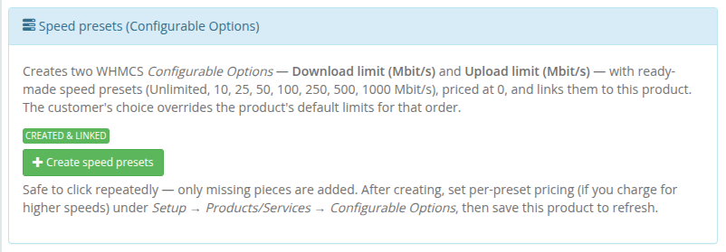
*35-product-config-speed-presets.png*

WHMCS **Configurable Options** let your customers choose their own download/upload speed at order time and change it later through an upgrade/downgrade — turning a single product into a whole speed-tier line-up. The module reads the selected values and applies them to the VPN client, overriding the product's default bandwidth.

Setting these up by hand is fiddly, so the module does it for you with **one button**.

### One-click creation

Click **Create speed presets** and the module instantly builds and links everything:

- a configurable-option group **PUQ VPNcp - Speed presets**;
- two dropdown options — **Download limit (Mbit/s)** and **Upload limit (Mbit/s)**;
- ready-made presets in each: **Unlimited, 10, 25, 50, 100, 250, 500, 1000 Mbit/s**, priced at `0` in every currency;
- a link from the group to the current product.

The button is **safe to click repeatedly** — only missing pieces are added, so your prices and edits are preserved. The status badge reflects the current state: *Not created yet* → *Created & linked*.

### What gets created

| Option Name | Type | Reads as | Preset sub-options (`value\|label`) |
|-------------|------|----------|--------------------------------------|
| `puqVPNcp_b_download\|Download limit (Mbit/s)` | Dropdown | per-client download cap (Mbit/s) | `0\|Unlimited`, `10\|10 Mbit/s`, `25\|25 Mbit/s`, `50\|50 Mbit/s`, `100\|100 Mbit/s`, `250\|250 Mbit/s`, `500\|500 Mbit/s`, `1000\|1000 Mbit/s` |
| `puqVPNcp_b_upload\|Upload limit (Mbit/s)` | Dropdown | per-client upload cap (Mbit/s) | same set as above |

The text before the `|` is the internal name the module matches on; the text after the `|` is what the customer sees. The sub-option value `0` means **Unlimited**.

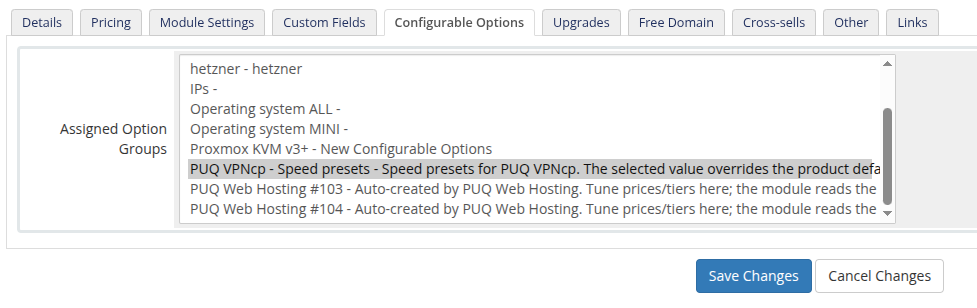
*36-configurable-options-assigned.png*

The group appears on the product's **Configurable Options** tab (already ticked under *Assigned Option Groups*) and under **System Settings → Products/Services → Configurable Options**.

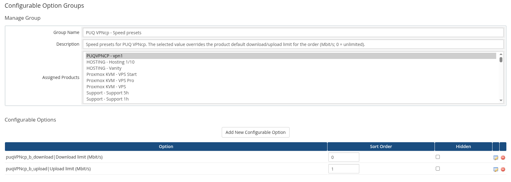
*37-configurable-options-group.png*

### Pricing the tiers

By default every preset is free (`0.00`), so customers can switch speeds at no cost. To monetise faster tiers, open each option and set per-cycle pricing on the sub-options — for example charge more for `500 Mbit/s` than for `50 Mbit/s`.

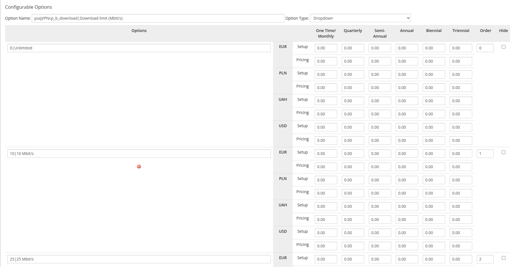
*38-configurable-options-download.png*


*39-configurable-options-upload.png*

After changing pricing, **save the product** to refresh the panel status.

### How the value is applied

| Priority | Source | When used |
|----------|--------|-----------|
| 1 (wins) | Configurable Option selection | whenever the option is assigned to the service (including `0` = unlimited) |
| 2 | Product **Bandwidth** default (Module Settings) | when no speed option is assigned |

On **provisioning** and on every **upgrade/downgrade** (WHMCS calls the module's change-package routine for configurable-option changes too), the module pushes the resolved `b_download` / `b_upload` to the panel via `PUT /api/v1/client/{name}`. So a customer who upgrades from *100 Mbit/s* to *500 Mbit/s* gets the new speed applied automatically, with no manual work for you.

> Adding the speed options is optional. Skip the button and every service simply uses the product's **Bandwidth** defaults.

---

## VPN Networks

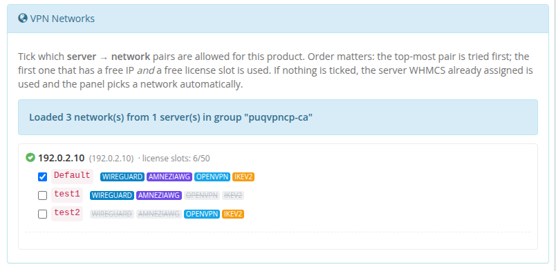
*10-product-config-vpn-networks.png*

On opening the product, the module contacts **every enabled `puqVPNcp` server in the product's server group** and calls `GET /api/v1/network` on each. The UI then shows a per-server tree — unreachable servers remain visible with their error so you can see exactly what went wrong. License-slot capacity (`used / total`) is displayed next to each reachable server.

Each checkbox is a **`server → network`** pair. Next to each network name, inline status badges indicate protocol availability:
- **WireGuard** (blue when enabled, strikethrough when disabled)
- **AmneziaWG** (purple when enabled, strikethrough when disabled)
- **OpenVPN** (cyan when enabled, strikethrough when disabled)
- **IKEv2** (amber when enabled, strikethrough when disabled)

Ticking the same network name on two different servers creates two independent pairs.

### How a server and network are picked at deploy time

1. The module reads all ticked pairs in the order they appear in the list (top to bottom).
2. For each pair it checks (a) free licence slots on that server (`count_accounts < count_accounts_available` from `GET /api/v1/system/status`) **and** (b) at least one free IP on the network (`GET /api/v1/network/{name}/available_ip`).
3. **The first pair that passes both checks wins.** The service is **reassigned** (`tblhosting.server` is updated) to the selected server, and the client is created on the selected network via `POST /api/v1/client`.
4. If nothing is ticked, `network_name` is omitted from the create call and the panel of the server WHMCS already picked decides automatically.
5. If ticks exist but none is deployable (every chosen server is out of slots or every chosen network is full), provisioning fails — nothing is silently created on a wrong network.

Because order matters, put your **preferred** pairs at the top.

If the whole group is unreachable a red banner appears at the top of the section; previously saved ticks are preserved through hidden inputs so your configuration is not lost when you re-save the product.

---

## Metric Billing (optional)

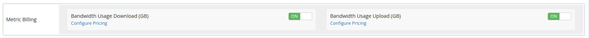
*11-product-config-metric-billing.png*

The module ships a WHMCS **Usage Billing** provider with two metrics:

- **Bandwidth Usage Download (GB)**
- **Bandwidth Usage Upload (GB)**

Enable the metrics on the product's **Pricing** tab to charge customers per GB of traffic. The provider pulls daily totals directly from the panel via `GET /api/v1/client/{name}/traffic/{Y}/{m}` and reports them in gigabytes for the current calendar month. No local accumulation table is used — values come live from the panel each time WHMCS runs the usage-billing cron.
 
### Configure metric pricing
 
Click **Configure Pricing** next to each metric to configure the billing scheme (**Per Unit**, **Total Volume**, or **Graduated**), the free included volume quota, and per-GB rates for all configured currencies:
 

*42-product-config-pricing-download.png*
 
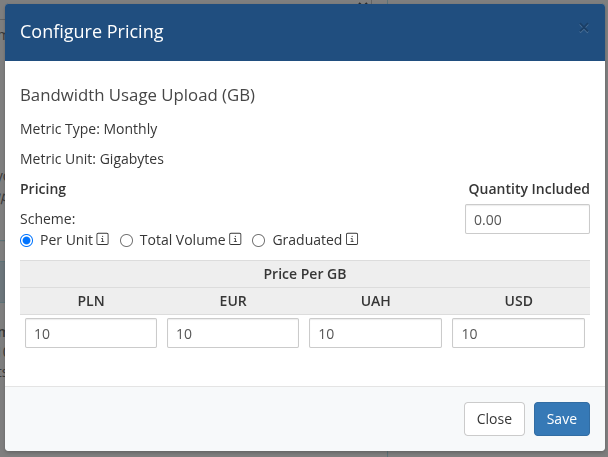
*43-product-config-pricing-upload.png*
