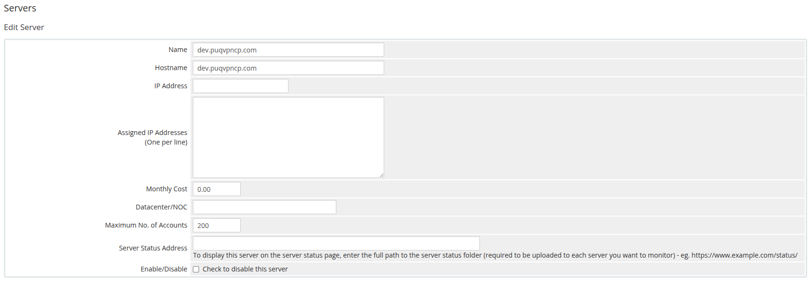
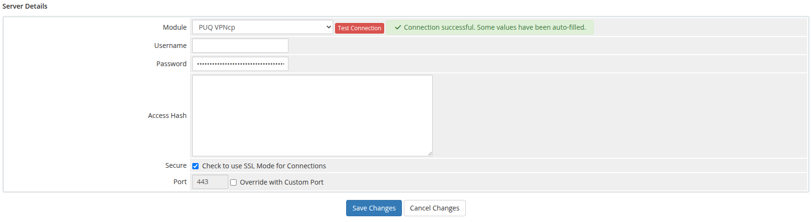

# Add server (PUQVPNCP panel)

### PUQVPNCP module **[WHMCS](https://puqcloud.com/link.php?id=77)**
#####  [Order now](https://puqcloud.com/whmcs-module-puqvpncp.php) | [Download](https://download.puqcloud.com/WHMCS/servers/PUQ_WHMCS-PUQVPNCP/) | [COMMUNITY](https://community.puqcloud.com/) | [PUQVPNCP](https://puqvpncp.com/)

## Add a PUQVPNCP panel to WHMCS

Navigate to **System Settings → Servers → Add New Server**.

---

### Step 1 — General settings

- **Name** — a descriptive label (e.g. `VPN Frankfurt`).
- **Hostname** — the panel's fully-qualified hostname (e.g. `vpn-fra.example.com`).
- **IP** — optional; used as fallback if hostname is empty.
- **Port** — leave empty for the default `80`/`443`, or enter a custom port.
- **Secure** — check when the panel is served over HTTPS (strongly recommended). SSL verification is enabled when this is checked.

*04-add-server-1.png*

---

### Step 2 — Module settings

1. Server Details section, **Type** dropdown: select **puqVPNcp**.
2. Leave **Username** empty (not used).
3. Paste the panel's **API token** into the **Password** field — this is what the module sends as `Authorization: Bearer <token>` for every API call.
4. Click **Test connection** — it calls `/api/v1/system/status`, `/api/v1/license` and `/api/v1/network` and returns OK on success.

*05-add-server-2.png*

> **Important:** The API token must have permissions to manage clients, query networks and read system status.

---

### Step 3 — Assign to a server group

For multi-server deployments, add the server to a WHMCS **server group**. Products bound to that group will list networks from every reachable server in it on the **VPN Networks** tree of the product configuration page — pick which `server → network` pairs are allowed for that product.
