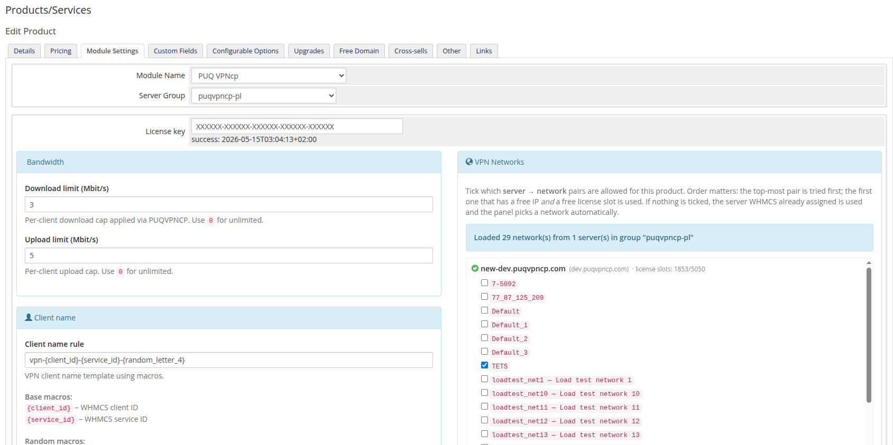
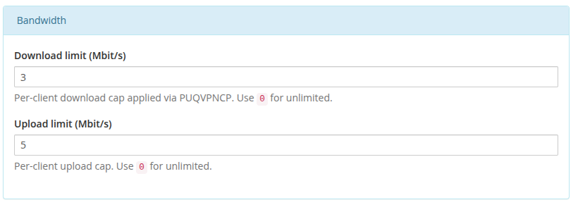
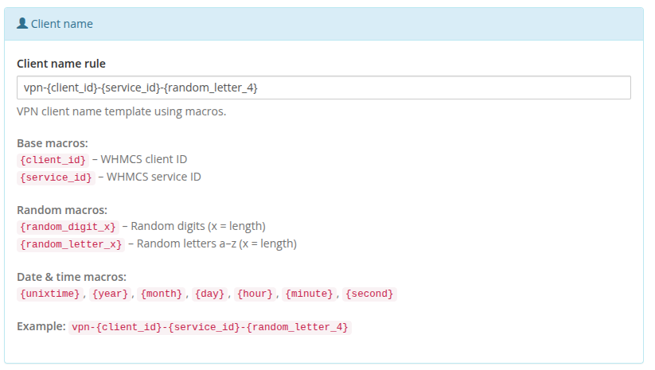
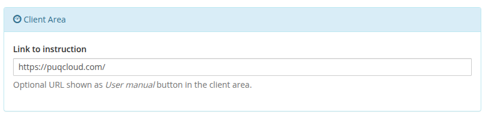
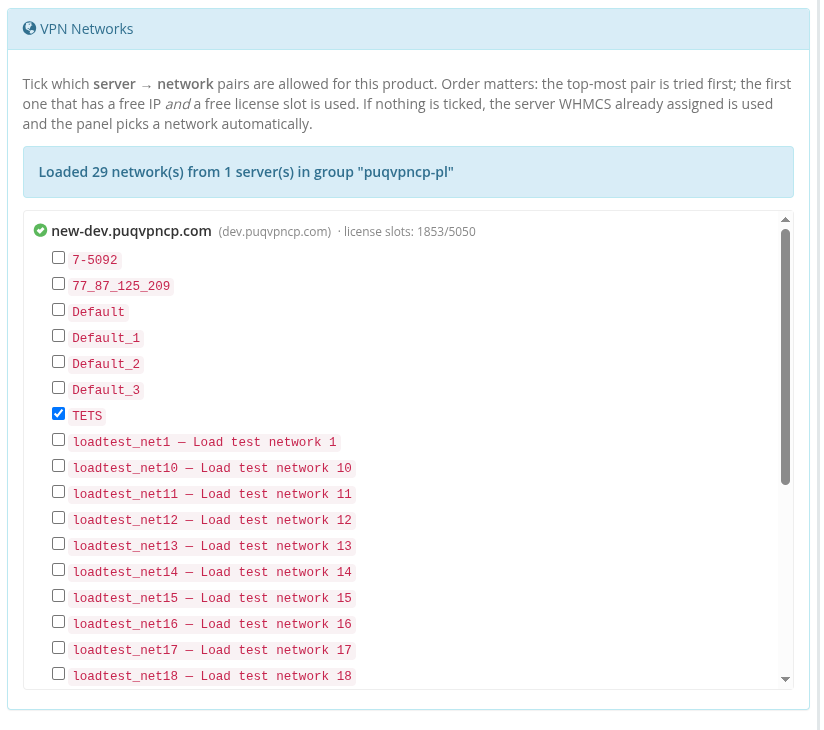
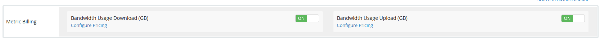

# Product configuration

### PUQVPNCP module **[WHMCS](https://puqcloud.com/link.php?id=77)**
#####  [Order now](https://puqcloud.com/whmcs-module-puqvpncp.php) | [Download](https://download.puqcloud.com/WHMCS/servers/PUQ_WHMCS-PUQVPNCP/) | [COMMUNITY](https://community.puqcloud.com/) | [PUQVPNCP](https://puqvpncp.com/)

## Create the product

1. Navigate to **System Settings → Products/Services → Products/Services → Create a New Product**.
2. Product Type: **Other**. Give it a name (e.g. `VPN — 100 Mbit/s`).
3. On the **Module Settings** tab, pick **PUQ VPNcp** as the module and assign a server (or a server group).

After saving, the module injects a **PUQ VPNcp settings** panel below the standard module fields. All settings are persisted as JSON in `configoption24` of the product record.

*06-product-configuration.png*

---

## License key

Paste your licence key into the **License key** field. The status row underneath shows the result of the most recent verification (`success: <timestamp>` or an error). The module re-checks the licence on every product page render and caches the result for the validity period encoded in the licence response.

---

## Bandwidth

*07-product-config-bandwidth.png*

- **Download limit (Mbit/s)** — per-client download cap. `0` = unlimited.
- **Upload limit (Mbit/s)** — per-client upload cap. `0` = unlimited.

The module applies these via `PUT /api/v1/client/{name}` right after creating the client. The `POST /api/v1/client` create call does not accept bandwidth fields — the limits are always pushed through the follow-up update.

If the bandwidth update fails, the freshly created client is **rolled back** with `DELETE /api/v1/client/{name}` so billing never starts charging for an uncapped VPN.

---

## Client name

*08-product-config-client-name.png*

- **Client name rule** — template used to generate the VPN client identifier. Default: `vpn-{client_id}-{service_id}-{random_letter_4}`.

Available macros:

**Base macros**
- `{client_id}` — WHMCS client ID
- `{service_id}` — WHMCS service ID

**Random macros**
- `{random_digit_N}` — N random digits (e.g. `{random_digit_5}`)
- `{random_letter_N}` — N random lowercase letters

**Date & time macros**
- `{unixtime}`, `{year}`, `{month}`, `{day}`, `{hour}`, `{minute}`, `{second}`

If the generated name already exists in `tblhosting.username`, the module appends `-1`, `-2`, … until it finds a free one.

---

## Client Area

*09-product-config-client-area.png*

- **Link to instruction** — optional URL shown as a **User manual** button at the top of the client-area home screen. Leave empty to hide the button.

---

## VPN Networks

*10-product-config-vpn-networks.png*

On opening the product, the module contacts **every enabled `puqVPNcp` server in the product's server group** and calls `GET /api/v1/network` on each. The UI then shows a per-server tree — unreachable servers remain visible with their error so you can see exactly what went wrong. License-slot capacity (`used / total`) is displayed next to each reachable server.

Each checkbox is a **`server → network`** pair. Ticking the same network name on two different servers creates two independent pairs.

### How a server and network are picked at deploy time

1. The module reads all ticked pairs in the order they appear in the list (top to bottom).
2. For each pair it checks (a) free licence slots on that server (`count_accounts < count_accounts_available` from `GET /api/v1/system/status`) **and** (b) at least one free IP on the network (`GET /api/v1/network/{name}/available_ip`).
3. **The first pair that passes both checks wins.** The service is **reassigned** (`tblhosting.server` is updated) to the selected server, and the client is created on the selected network via `POST /api/v1/client`.
4. If nothing is ticked, `network_name` is omitted from the create call and the panel of the server WHMCS already picked decides automatically.
5. If ticks exist but none is deployable (every chosen server is out of slots or every chosen network is full), provisioning fails — nothing is silently created on a wrong network.

Because order matters, put your **preferred** pairs at the top.

If the whole group is unreachable a red banner appears at the top of the section; previously saved ticks are preserved through hidden inputs so your configuration is not lost when you re-save the product.

---

## Metric Billing (optional)

*11-product-config-metric-billing.png*

The module ships a WHMCS **Usage Billing** provider with two metrics:

- **Bandwidth Usage Download (GB)**
- **Bandwidth Usage Upload (GB)**

Enable the metrics on the product's **Pricing** tab to charge customers per GB of traffic. The provider pulls daily totals directly from the panel via `GET /api/v1/client/{name}/traffic/{Y}/{m}` and reports them in gigabytes for the current calendar month. No local accumulation table is used — values come live from the panel each time WHMCS runs the usage-billing cron.
