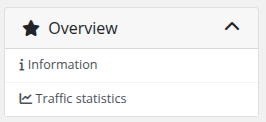
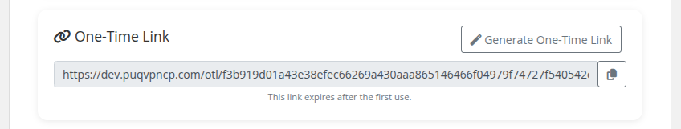
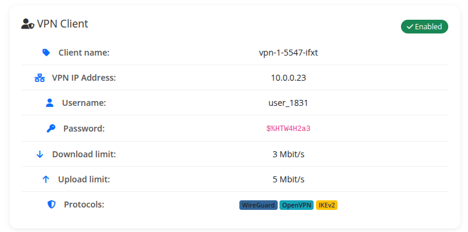
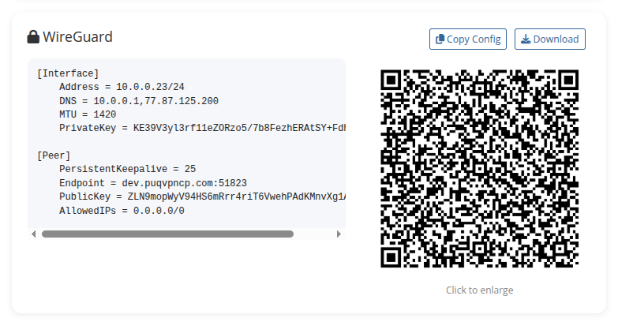
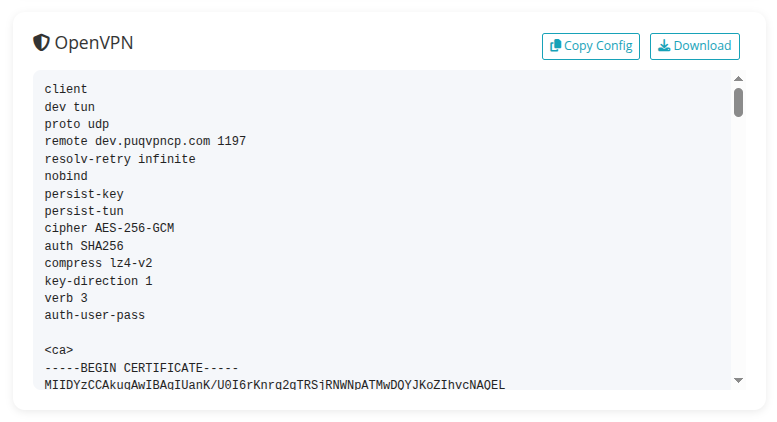
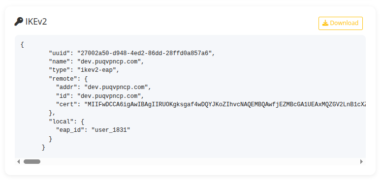

# Home screen

### PUQVPNCP module **[WHMCS](https://puqcloud.com/link.php?id=77)**
#####  [Order now](https://puqcloud.com/whmcs-module-puqvpncp.php) | [Download](https://download.puqcloud.com/WHMCS/servers/PUQ_WHMCS-PUQVPNCP/) | [COMMUNITY](https://community.puqcloud.com/) | [PUQVPNCP](https://puqvpncp.com/)

The product details page is the **Information** tab — the module's main client-facing view. Everything on it is loaded dynamically from the PUQVPNCP panel via AJAX the moment the page opens.

*12-home-screen-connection.png*

---

## Sidebar

The module replaces the default *Information* sidebar entry with two of its own:

- **Information** — the page documented here.
- **Traffic statistics** — see [Traffic statistics](03-traffic-statistics.md).

*13-home-screen-sidebar.png*

---

## User manual

If a *Link to instruction* is set in the product configuration, a **User manual** button appears at the top of the page linking to that URL.

---

## Connection status

A live block at the top of the page that polls `/api/v1/client/online` every 5 seconds (paused while the browser tab is hidden) and shows one card per protocol the client is currently connected on:

- **WireGuard** — blue accent, lock icon
- **OpenVPN** — amber accent, shield icon
- **IKEv2** — purple accent, key icon

Each card shows: VPN IP, network, endpoint, last handshake (with relative time suffix) and downloaded/uploaded bytes (humanised B/KB/MB/GB). The header pill is **Online** (green) when at least one protocol reports a session, **Offline** (red) otherwise.

A manual **Refresh** button next to the badge forces an immediate fetch.

---

## One-Time Link (OTL)

A button that calls `POST /api/v1/client/{name}/otl` and displays a single-use self-service URL the customer can open once to configure their device without re-entering credentials.

*14-home-screen-otl.png*

> The link expires after the first use. The endpoint is POST-only — opening the URL by accident in a browser tab does not consume the token.

---

## VPN Client

Static card with the panel's authoritative client record:

*15-home-screen-vpn-client.png*

- **Client name** — the identifier on the panel
- **VPN IP Address** — assigned IPv4
- **Username** — auth username (used by IKEv2 / OpenVPN)
- **Password** — auth password (shown as `<code>`)
- **Download / Upload limit** — Mbit/s caps or *Unlimited*
- **Protocols** — coloured badges for WireGuard / OpenVPN / IKEv2; only protocols actually enabled on the client's network are shown

A status pill in the top-right reads **Enabled** (green) when the panel reports `status:enable`, **Disabled** (red) otherwise.

---

## WireGuard

Shown when WireGuard is enabled on the client's network:

*16-home-screen-wireguard.png*

- `.conf` text in a monospace block with **Copy Config** and **Download** buttons
- QR code generated by the panel (click to enlarge in a lightbox; close with the × button or `Esc`)

---

## OpenVPN

Shown when OpenVPN is enabled on the client's network:

*17-home-screen-openvpn.png*

The full `.ovpn` profile text with **Copy Config** and **Download** buttons.

---

## IKEv2

Shown when IKEv2 is enabled on the client's network:

*18-home-screen-ikev2.png*

The IKEv2 profile (JSON) with a **Download** button.

---

## Traffic statistics

The **Traffic statistics** entry in the sidebar opens a separate page — see [Traffic statistics](03-traffic-statistics.md).
