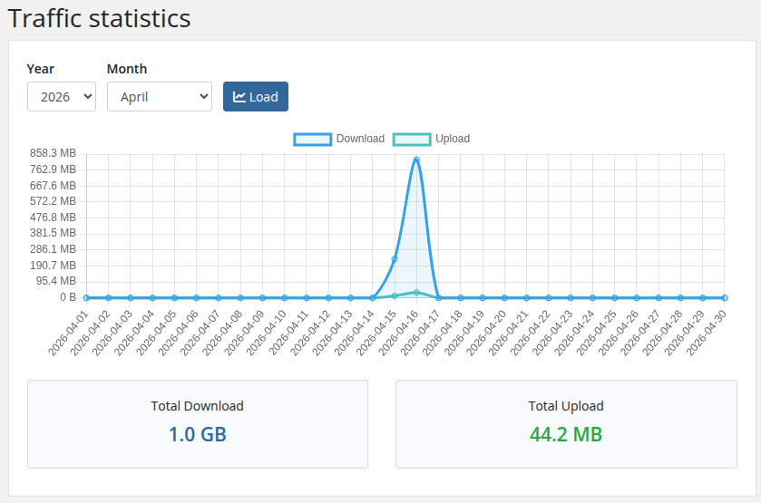

# Traffic statistics

### PUQVPNCP module **[WHMCS](https://puqcloud.com/link.php?id=77)**
#####  [Order now](https://puqcloud.com/whmcs-module-puqvpncp.php) | [Download](https://download.puqcloud.com/WHMCS/servers/PUQ_WHMCS-PUQVPNCP/) | [COMMUNITY](https://community.puqcloud.com/) | [PUQVPNCP](https://puqvpncp.com/)

A dedicated page in the client area showing monthly traffic for the VPN client. Entered from the service sidebar via **Traffic statistics** (`action_m=traffic_statistics`).

*19-traffic-statistics.png*

## Controls

- **Year** / **Month** selectors — default to the current month. The Year dropdown lists the last four years.
- **Load** button — refetches data for the chosen period.

## Chart

A line chart rendered with Chart.js showing per-day:

- **Download** (blue line, filled area)
- **Upload** (green line, filled area)

All values are formatted with a human-readable `B / KB / MB / GB / TB` scale on hover and on the Y axis.

## Totals

Two cards below the chart show the aggregated total download (blue) and total upload (green) for the selected month.

## Data source

The page calls `GET /api/v1/client/{name}/traffic/{year}/{month}` on the PUQVPNCP panel every time **Load** is pressed. The module does not cache samples — values come live from the panel each render.
