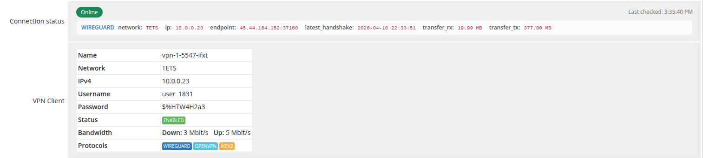
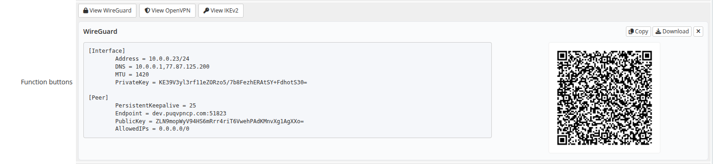
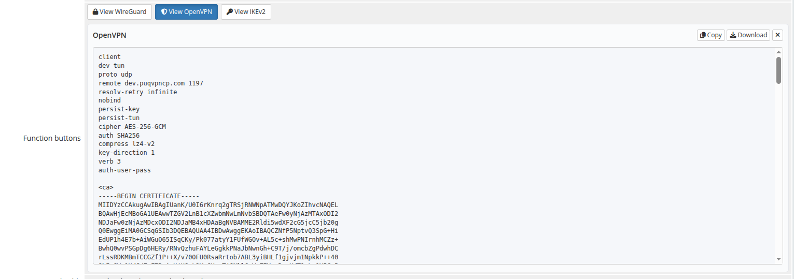
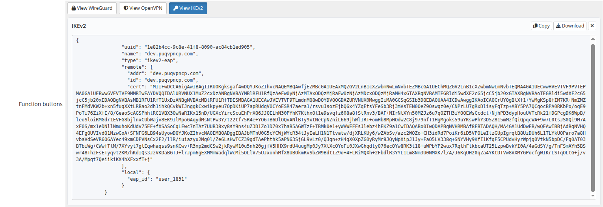
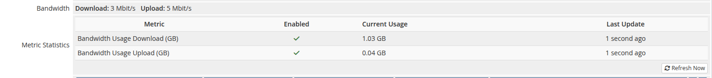
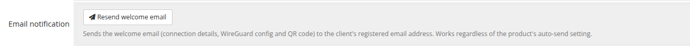
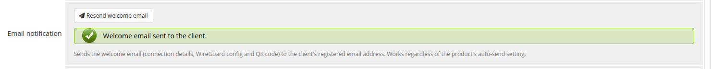

# Product information (admin service tab)

### PUQVPNCP module **[WHMCS](https://puqcloud.com/link.php?id=77)**
#####  [Order now](https://puqcloud.com/whmcs-module-puqvpncp.php) | [Download](https://download.puqcloud.com/WHMCS/servers/PUQ_WHMCS-PUQVPNCP/) | [COMMUNITY](https://community.puqcloud.com/) | [PUQVPNCP](https://puqvpncp.com/)

Open **Clients → View/Search Clients → (client) → Products/Services → (service)**. The module adds a set of fields to the standard admin service tab — all populated live from the PUQVPNCP panel via AJAX.

*20-product-information.png*

---

## License Verification

Shown only when the product's licence check fails — a red **errorbox** with the verification error. Fix the licence on the product configuration page and re-open the service.

---

## Connection status

*21-product-info-status-client.png*

A live block at the top that polls `GET /api/v1/client/online` every 5 seconds and shows one row per protocol the client is currently connected on.

The header pill is **Online** (green) when at least one protocol reports a session, **Offline** (red) otherwise. *Last checked* timestamp updates after every poll.

Each protocol row exposes the raw fields the panel returns (network, IP, endpoint, last handshake, transferred bytes), formatted for readability — bytes are humanised, the latest handshake gets a relative-time chip.

---

## VPN Client

A table populated from `GET /api/v1/client/{name}` with the panel's authoritative client record:

- **Name** — identifier on the panel
- **Network** — VPN network the client is on
- **IPv4** — assigned VPN IP
- **Username** — auth username (used by IKEv2 / OpenVPN)
- **Password** — auth password
- **Status** — `Enabled` (green label) or `Disabled` (red)
- **Bandwidth** — current `Down: X Mbit/s · Up: Y Mbit/s` caps (or *Unlimited*)
- **Protocols** — coloured labels for WireGuard / OpenVPN / IKEv2; protocols disabled on the network are shown greyed-out and struck-through

---

## Function buttons

Three buttons that fetch and inline-display the protocol configuration for the client. Buttons for protocols disabled on the network are greyed-out, marked `cursor:not-allowed`, and carry a tooltip explaining why they cannot be opened.

### View WireGuard

*22-product-info-wireguard.png*

Calls `GET /api/v1/client/{name}/config/text` and `/config/qr`. Shows the `.conf` text alongside the QR code (the layout collapses to full-width text when no QR is returned). **Copy** and **Download** buttons act on the visible config; **×** closes the panel.

### View OpenVPN

*23-product-info-openvpn.png*

Calls `GET /api/v1/client/{name}/openvpn/profile` and shows the full `.ovpn` file. The block uses 100 % width because no QR is rendered.

### View IKEv2

*24-product-info-ikev2.png*

Calls `GET /api/v1/client/{name}/ikev2/profile` and shows the IKEv2 profile (JSON). Long base64 certificate strings wrap inside the box and never expand it horizontally.

---

## Bandwidth

*25-product-info-bandwidth.png*

Read-only summary of the per-client caps configured on the product: **Download** and **Upload** in Mbit/s, or **Unlimited** when the value is `0`. To change them, edit the product's *Bandwidth* fields on the Module Settings tab.

---

## Email notification

*40-product-info-email-notification.png*

A **Resend welcome email** button that re-sends the welcome message — connection details, WireGuard config and QR code — to the client's registered email address on demand. Handy when a customer loses the original email or you onboard them manually.

It sends **regardless** of the product's auto-send setting, so you can leave automatic sending off and dispatch the email only when you choose. A confirmation prompt protects against accidental clicks; the result is shown inline.

*41-product-info-resend-success.png*

---

## Metric Statistics

WHMCS-rendered block (not part of the module's tab fields, shown when the product has Usage Billing metrics enabled). Lists the metric, its enabled state, current usage and last update time. Values come from the module's metric provider, which fetches monthly traffic totals from the panel via `GET /api/v1/client/{name}/traffic/{Y}/{m}` and reports them in gigabytes.

Click **Refresh Now** to re-poll the panel immediately.
