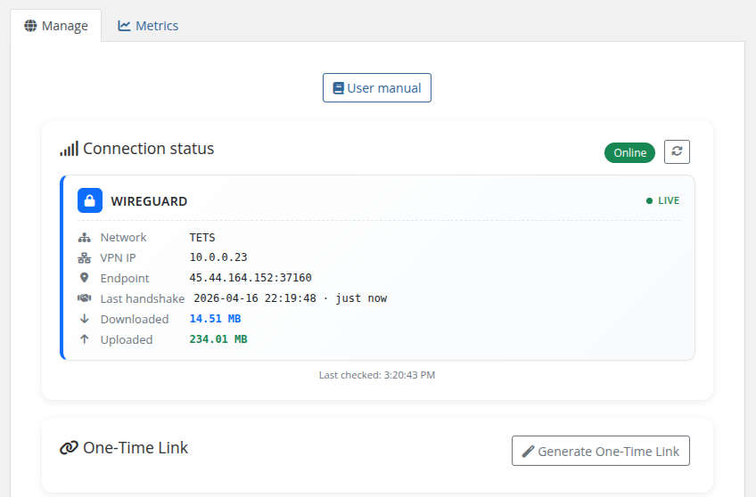
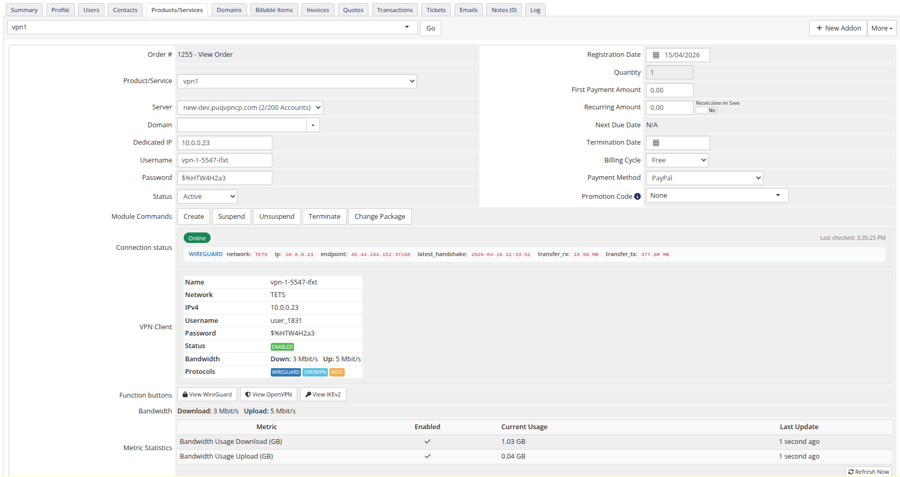

# Description

### PUQVPNCP module **[WHMCS](https://puqcloud.com/link.php?id=77)**
#####  [Order now](https://puqcloud.com/whmcs-module-puqvpncp.php) | [Download](https://download.puqcloud.com/WHMCS/servers/PUQ_WHMCS-PUQVPNCP/) | [COMMUNITY](https://community.puqcloud.com/) | [PUQVPNCP](https://puqvpncp.com/)

## PUQVPNCP WHMCS module

The PUQVPNCP WHMCS module is a provisioning module that integrates WHMCS with PUQVPNCP panels, enabling service providers to offer multi-protocol VPN accounts (WireGuard, OpenVPN, IKEv2) to their customers. The module automates the full lifecycle of VPN client management through the PUQVPNCP REST API.

---

## Main features

- **Automatic VPN client provisioning** — creates the client on the chosen PUQVPNCP panel on service activation
- **Account lifecycle management** — create, suspend, unsuspend, terminate and change-package operations
- **Multi-protocol support** — WireGuard, OpenVPN and IKEv2, with protocol availability detected automatically
- **Configuration delivery** — WireGuard `.conf` + QR code, OpenVPN `.ovpn` profile and IKEv2 profile, all with Copy/Download buttons in the client area
- **Per-client bandwidth limits** — configure download/upload caps (Mbit/s) per product; `0` means unlimited
- **Speed tiers in one click** — auto-create WHMCS Configurable Options for download/upload speed (Unlimited → 1000 Mbit/s); customers pick their tier at checkout and upgrade/downgrade anytime, with the new speed applied automatically
- **Welcome email with configs** — optionally email the client their connection details, WireGuard config and QR code the instant the account is provisioned; admins can re-send on demand
- **Flexible network selection** — pick one or more VPN networks per product; the module iterates them at provisioning time and uses the first one with a free IP
- **Traffic statistics** — monthly chart (download/upload per day) with totals, powered by the panel API
- **One-time self-service link (OTL)** — generate a single-use URL that hands the customer every protocol config, QR code and credential on a page that opens only once
- **Admin insight** — service admin tab shows API connection status, remote client state, bandwidth and resolved location
- **License verification** — built-in license system with online/offline verification and admin alerts

---

## System requirements

| Requirement | Minimum |
|-------------|---------|
| WHMCS | 9.x or higher |
| PHP | 8.2 or higher |
| PUQVPNCP panel | current |
| ionCube Loader | v13 or newer (v14, v15) |

---

## Links

- **Product page:** [https://puqcloud.com/whmcs-module-puqvpncp.php](https://puqcloud.com/whmcs-module-puqvpncp.php)
- **PUQVPNCP panel:** [https://puqvpncp.com/](https://puqvpncp.com/)
- **Documentation:** [https://doc.puq.info/books/puqvpncp-whmcs-module](https://doc.puq.info/books/puqvpncp-whmcs-module)
- **Support:** [https://puqcloud.com/submitticket.php](https://puqcloud.com/submitticket.php?step=2&deptid=1)
- **Community:** [https://community.puqcloud.com/](https://community.puqcloud.com/)

---

## Screenshots

### Client area — Home screen

*01-description-client-area.png*

### Client area — Traffic statistics

*02-description-traffic-stats.png*

### Admin area — Product information

*03-description-admin-area.png*
